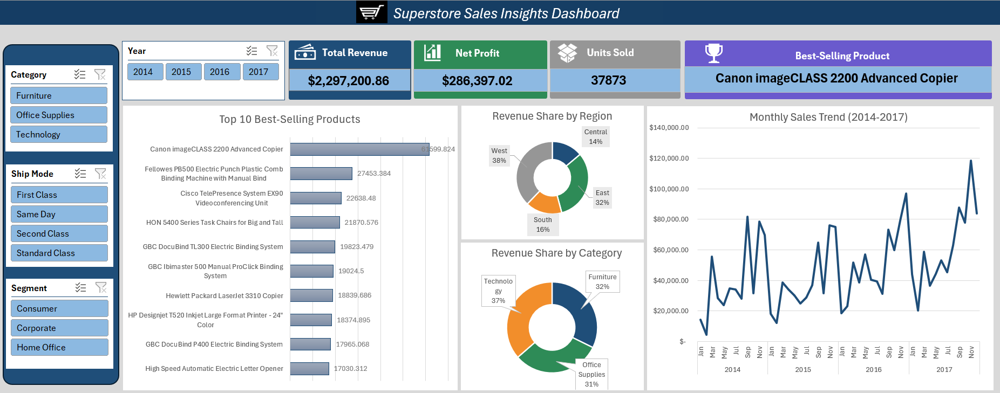

# 📊 Excel Sales Performance Dashboard  

This project was developed during my **Data Analytics Internship at Elevvo Pathways**.  
The main objective was to design an **interactive dashboard in Excel** to track and analyze sales performance, using the **Superstore Sales Dataset**.  

---

## 🔎 Project Summary  
The dashboard brings together sales insights in one place, helping to monitor performance and spot trends quickly.  
It allows users to explore the data through **dynamic visuals and slicers**, answering questions like:  

- 💰 Which products contribute the most to revenue?  
- 🛒 How are sales distributed across categories and regions?  
- 📆 What patterns do we see in monthly sales?  
- 👤 Which customer segments perform best?  

---

## ⚙️ Features & Highlights  
- **Data Cleaning & Preparation** – ensured dataset consistency and usability  
- **Key Performance Indicators (KPIs):** total revenue, profit, quantity sold, top product  
- **Pivot Tables & Charts** – to summarize and highlight business insights  
- **Visual Elements:**  
  - Bar Chart → Top 10 Products by Sales  
  - Pie Charts → Regional & Category Breakdown  
  - Line Chart → Monthly Sales Trends  
- **Interactive Slicers** – filter by Segment, Category, Ship Mode, and Year  

---

## 📁 Project Files  
- `Sales_Dashboard.xlsx` → Final interactive dashboard  
- `Superstore_Dataset.csv` → Raw dataset (from Kaggle Superstore Sales)  
- `excel_superstore_dashboard.png` → Snapshot of the dashboard  

---

## 🖼️ Dashboard Snapshot  

## 🚀 Tools & Skills Applied  
- Microsoft Excel (formulas, pivot tables, charts)  
- Data Cleaning & Preparation  
- KPI tracking & business analysis  
- Dashboard design & visualization  

---

## 🔗 Internship Task  
This project was created as part of **Task 01** in the Elevvo Pathways Internship:  
➡️ *Excel Sales Performance Dashboard*  

---

## 🙌 Acknowledgement  
Grateful to **Elevvo Pathways** for providing this opportunity to work on real-world data analytics tasks.  
