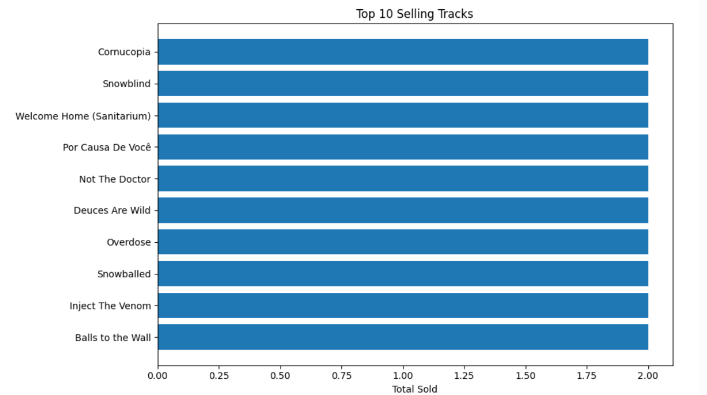

# 🗄️ SQL-Based Analysis of Product Sales (Chinook Database)

This project was completed as part of my **Data Analytics Internship at Elevvo Pathways**.  
The goal of this task was to use **SQL queries on the Chinook Database** to extract meaningful business insights and then visualize the results using **Python (Matplotlib & Seaborn)**.

---

## 📌 Project Overview
The **Chinook Database** is a sample database for a digital music store containing tables for customers, invoices, tracks, genres, and more.  

In this task, I connected the database with Python, explored its structure, and answered key business questions such as:
- Who are the top-spending customers?
- Which regions contribute the most revenue?
- What are the most popular tracks?
- Which music genres perform the best?
- How does monthly revenue trend over time?

---

## 🛠️ Key Insights & Visualizations

### 1️⃣ Top 10 Customers by Spending
- Query combined **Customer**, **Invoice**, and **InvoiceLine** tables.  
- Result: Identified the **10 customers with the highest spending**.  

📊 Visualization:  

---

### 2️⃣ Revenue by Country
- Aggregated revenue across all countries.  
- Result: Found **which regions generated the highest sales**.  

📊 Visualization:  

---

### 3️⃣ Top 10 Selling Tracks
- Analyzed purchases from **InvoiceLine** joined with **Track**.  
- Result: The **10 most popular tracks** purchased by customers.  

📊 Visualization:  

---

### 4️⃣ Revenue by Genre
- Grouped tracks by **Genre** and calculated total revenue.  
- Result: Showed **which genres drive the most revenue**.  

📊 Visualization:  

---

### 5️⃣ Monthly Revenue Trends
- Extracted revenue data month by month.  
- Result: Clear view of **revenue performance over time**.  

📊 Visualization:  

---

## 🚀 Skills Applied
- **SQL Querying** (JOINs, GROUP BY, Aggregations)  
- **Data Analysis** with Pandas  
- **Data Visualization** (Matplotlib, Seaborn)  
- **Business Insights** (customer value, product performance, revenue trends)

---

## 📂 Files Included
- `(SQL_based_Analysis).ipynb` → Python notebook with SQL queries and visualizations  
- `1st-visualization.png` → Top 10 Customers by Spending  
- `2nd-visualization.png` → Sales by Country  
- `3rd-visualization.png` → Top 10 Selling Tracks  
- `4th-visualization.png` → Revenue by Genre  
- `5th-visualization.png` → Monthly Revenue Trends  

---

## 📜 Acknowledgement
This project was developed as part of **Task 05** of my Data Analytics Internship at *Elevvo Pathways*.  

