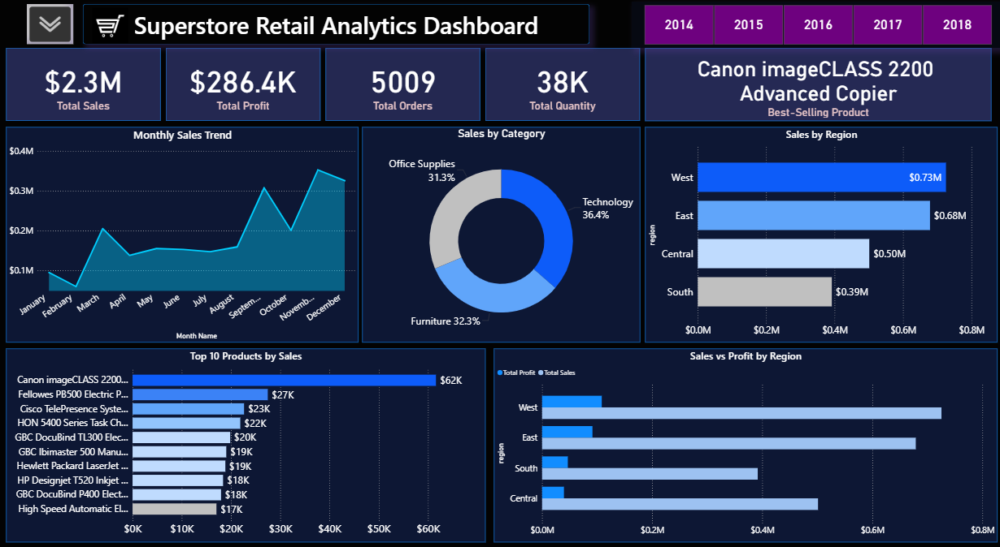

# 🛒 Superstore Retail Analytics Dashboard | Power BI

## 📌 Overview
This project is a **Superstore Retail Analytics Dashboard** built in Power BI using a Superstore dataset.  
It provides key insights into sales, profit, orders, and product performance through interactive visuals.

---

## 🚀 Features
- **5 KPI Cards**:
  - Total Sales  
  - Total Profit  
  - Total Orders  
  - Total Quantity  
  - Best-Selling Product 

- **4 Charts + Donut Chart**:
  - Sales by Region  
  - Monthly Sales Trend  
  - Top 10 Best-Selling  Products
  - Sales vs Profit by Region  
  - Sales Share by Category (Donut Chart)  

- **Interactive Slicers** (toggle with button):
  - Region
  - Customer Name
  - Category  
  - Year  

---

## 📊 Insights
- Quickly analyze **top performing products**.  
- Identify **regional sales trends** and profitability.  
- Track **monthly sales growth**.  
- Compare **sales vs profit distribution**.  
- Explore **category-wise contribution** with the donut chart.  

---

## 🛠️ Tools Used
- Power BI  
- Superstore Dataset (sample retail data)  

---

## 📷 Dashboard Preview  

## 👨‍💻 Author
**Sharjeel Majeed** – BS Artificial Intelligence Student | Aspiring Data Scientist  

